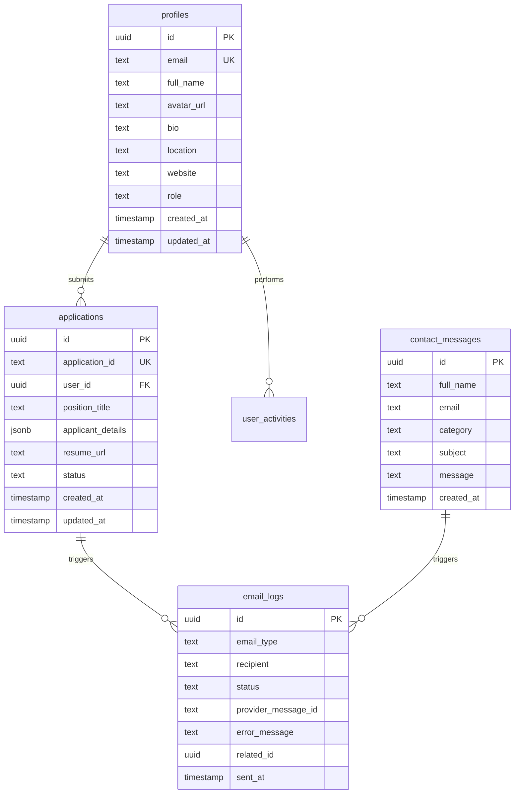

<p align="center">
  
</p>

# PGT Global Network Website

The official, production-ready web platform for PGT Global Network. Designed as a premium, highly responsive single-page application (SPA), the platform serves as a public interface, recruitment hub, and member portal. It integrates Supabase for secure user authentication, database triggers, storage buckets, and Edge Functions to orchestrate transactional email workflows via Resend. The frontend is built on React 18, TypeScript, and Tailwind CSS, offering a visual-first layout equipped with custom micro-animations, background canvas overlays, and interactive tracking dashboards.

---

## Table of Contents

1. [About the Project](#about-the-project)
2. [Features](#features)
3. [Tech Stack](#tech-stack)
4. [Project Structure](#project-structure)
5. [Getting Started](#getting-started)
6. [Environment Variables](#environment-variables)
7. [Database Architecture](#database-architecture)
8. [Email Automation Workflows](#email-automation-workflows)
9. [Page Directory](#page-directory)
10. [Security Features](#security-features)
11. [Deployment Config](#deployment-config)
12. [License](#license)
13. [Author](#author)
14. [Footer](#footer)

---

## About the Project

PGT Global Network is a global organization dedicated to creating a space where purpose turns into action, growth is cultivated through real-world learning, and transformation becomes a shared journey. Empowering individuals across 15+ countries, the network bridges the gap between potential and execution.

The PGT Global Network website is engineered as a secure, premium digital environment to drive this mission. It serves a dual purpose: providing public engagement pages that articulate the organization's vision, founding principles, and historical milestones, while simultaneously offering a restricted gateway for candidate recruitment and application management. By implementing deep integration with Supabase and Resend, the website streamlines transactional communications, profile modifications, and document uploads.

---

## Features

### 🌐 Public Website
*   **Immersive Home & Hero Layouts:** Parallax radial mesh overlays, scroll indicator links, and announcement bars to capture new visitor interest.
*   **Ventures Showcase:** A scalable portfolio displaying PGT's digital ecosystems (such as PGT Technologies) with status indicators and site targets.
*   **Media Gallery:** Interactive, visual catalog of events, initiatives, and corporate sessions.
*   **Core Programs:** Deep dives into D3, VoA, Seminarix, MotivMinds, and HED initiatives.
*   **Timeline History:** Visual chronological journey tracking PGT's global milestones.
*   **Impact Tracking:** Live numerical metrics displaying global achievements utilizing count-up animations.
*   **Article Blog:** Responsive news section supporting details display, categories, and reader likes.

### 🔑 Authentication & Portal
*   **Supabase Auth Framework:** High-security user onboarding, password recoveries, and active session management.
*   **OAuth Integration:** Rapid signup and login support through Google accounts.
*   **Cloudflare Turnstile CAPTCHA:** Integrated defense against automated attacks on signup, login, password recovery, and email verification endpoints.
*   **Automatic Profile Binding:** Database triggers that instantly map newly registered auth identities to public profile records.

### 💼 Recruitment System
*   **Dynamic Careers Hub:** Categorized openings highlighting title, commitment type, location, and key requirements.
*   **Resume Storage Integration:** Automated document uploading directly from the application form to secure Supabase storage buckets.
*   **Unique Candidate IDs:** Automatic alphanumeric code assignment (e.g., `PGT-2026-XXXX`) utilizing PostgreSQL sequences.

### 📨 Contact System
*   **Enquiry Categorization:** Dropdowns mapping specific requests (General, Partnership, Volunteering, Media, Support) to trigger targeted email routing.
*   **Validation Checkpoints:** Custom frontend and trigger validation to reject improper formats before server execution.

### 📊 User Dashboard
*   **Profile Manager:** Forms to update full names, bios, location details, personal sites, and social links (LinkedIn, Instagram, YouTube, Facebook).
*   **Image Canvas Modals:** In-browser modal cropping and uploading of profile photos to the `avatars` bucket.
*   **Application Tracking:** Live candidate logs detailing submission dates, positions, and current workflow status (`Submitted`, `Reviewed`, `Accepted`, `Rejected`).
*   **Activity Auditor:** Log listing showing recent user interactions and system updates.

### 🛡️ Security & Performance
*   **Strict Row Level Security (RLS):** Policies restricting read/write queries to authenticated owners or administrative groups.
*   **Optimized Routing:** Nested navigation with `react-router-dom` v7.7.0, complete with `ProtectedRoute` guards and route loading hooks.
*   **Micro-Animations:** Custom CSS layouts and intersection observers generating entry effects on viewport scroll.

---

## Tech Stack

### Frontend Core
*    — Dynamic UI view rendering
*    — Type safety and auto-completion
*    — Project bundler and dev server
*    — Utility styling framework
*    — Application routing framework
*    — Touch-supported slide components

### Backend & Cloud Services
*    — Auth database and storage framework
*    — Relational core storage engine
*    — Serverless runtime hosting the Edge Functions
*    — High-delivery transaction mailing system
*    — CAPTCHA bot protection

---

## Project Structure

```text
PGT-Global-Network-Website/
├── public/                     # Static assets and icons
│   ├── PGT New Logo Transparent.png
│   ├── logo.svg
│   └── favicon.ico
├── src/                        # Frontend source codebase
│   ├── assets/                 # Custom images and media
│   ├── components/             # Reusable UI component modules
│   │   ├── AnimatedBackground.tsx  # Dynamic floating bubble overlays
│   │   ├── AnimatedCard.tsx       # Entry animations wrapper
│   │   ├── AnnouncementBar.tsx    # Text marquee alerts banner
│   │   ├── Footer.tsx             # Theme footer with socials & navigation
│   │   ├── HeroBackground.tsx     # Mesh header backdrop
│   │   ├── ImageUploadModal.tsx   # Canvas-based profile pic cropper
│   │   ├── LoadingSpinner.tsx     # Global page loader component
│   │   ├── Navbar.tsx             # Interactive header menu
│   │   ├── ProtectedRoute.tsx     # Routing authentication guard
│   │   └── ScrollToTop.tsx        # Viewport navigation resetter
│   ├── contexts/               # Global React state modules
│   │   └── AuthContext.tsx        # Supabase Session, Signin, Signup and Signout Context
│   ├── data/                   # Mock and static storage modules
│   │   └── articles.ts            # Blog articles definition
│   ├── hooks/                  # Custom React hooks
│   │   ├── useCountUp.ts          # Statistical numerical counter
│   │   ├── usePageLoading.ts      # Active path changes listener
│   │   └── useScrollToTop.ts      # Auto scroll trigger
│   ├── lib/                    # SDK initializations
│   │   └── supabase.ts            # Client Supabase configuration
│   ├── pages/                  # Route view components
│   │   ├── auth/                  # Password and email auth layouts
│   │   ├── About.tsx              # Organization values and CEO message
│   │   ├── Apply.tsx              # Job / Internship application form
│   │   ├── Careers.tsx            # Openings overview and details
│   │   ├── Contact.tsx            # Categorized contact inquiry forms
│   │   ├── Dashboard.tsx          # Profile manager and status tracks
│   │   ├── Home.tsx               # Homepage and mission
│   │   ├── Impact.tsx             # Stats graphs and success profiles
│   │   ├── Ventures.tsx           # Ecosystem venture listings
│   │   └── ...
│   ├── App.tsx                 # Main routes and application wrapper
│   └── main.tsx                # Mount execution script
├── supabase/                   # Supabase environment configuration
│   ├── functions/              # Edge serverless functions
│   │   └── send-emails/           # Deno Edge Function mailing endpoint
│   │       ├── services/             # Database and mail services
│   │       ├── templates/            # HTML branding template configurations
│   │       └── index.ts              # Entry script routing database hooks
│   ├── migrations/             # Database structure and security policies
│   └── email_templates.md      # Reference documentation for standard Auth templates
├── package.json                # Project dependencies and workspace configurations
├── vercel.json                 # Deploy mappings for single-page applications
└── vite.config.ts              # Vite compiler config
```

---

## Getting Started

### Prerequisites
*   **Node.js:** version `18.x` or above.
*   **NPM:** version `9.x` or above.
*   **Supabase CLI:** installed locally (for testing Edge Functions and database migrations).

### Setup Steps

1.  **Clone the Repository:**
    ```bash
    git clone https://github.com/pranav-gujar/PGT_Global_Network.git
    cd PGT_Global_Network
    ```

2.  **Install Dependencies:**
    ```bash
    npm install
    ```

3.  **Configure Local Environment:**
    Create a `.env` file in the root directory:
    ```ini
    VITE_SUPABASE_URL=your_supabase_project_url
    VITE_SUPABASE_ANON_KEY=your_supabase_anon_client_key
    VITE_TURNSTILE_SITE_KEY=your_cloudflare_turnstile_site_key
    ```

4.  **Execute Local Server:**
    ```bash
    npm run dev
    ```
    Open `http://localhost:5173/` in your web browser.

---

## Environment Variables

### Frontend Variables (`.env`)

| Variable Name | Type | Description |
| :--- | :--- | :--- |
| `VITE_SUPABASE_URL` | String (URL) | Supabase project API gateway endpoint URL. |
| `VITE_SUPABASE_ANON_KEY` | String (JWT) | Anonymous client API key (safe for client bundling). |
| `VITE_TURNSTILE_SITE_KEY` | String | Cloudflare Turnstile public key used to verify user sessions. |

### Edge Function Secret Keys (Stored securely in Supabase Secrets)

| Secret Key Name | Type | Description |
| :--- | :--- | :--- |
| `RESEND_API_KEY` | String | Secure token used to dispatch transactions via Resend APIs. |
| `SUPABASE_SERVICE_ROLE_KEY` | String (JWT) | Administrative bypass key used to audit logs without RLS restrictions. |

---

## Database Architecture

The data engine runs on PostgreSQL, fully managed through Supabase. Tables enforce relational mappings, indexes, and Row Level Security (RLS).



### Core Schema Overview

1.  **`profiles`**: Maps 1-to-1 with `auth.users`. Contains user profiles. Restricted to owner access (`auth.uid() = id`), while administrative access allows reads on all lines. Role updates are filtered to prevent client privilege escalation.
2.  **`applications`**: Stores candidate submissions. Uses a unique identifier (`PGT-2026-XXXX`). Linked to a secure storage URL representing the applicant's resume.
3.  **`contact_messages`**: Receives public contact inquiries. Write access is open to all visitors (`anon` and `authenticated`), while read access is restricted to administrative roles (`is_admin()`).
4.  **`email_logs`**: Internal audit trail logging transaction outcomes (`Sent`, `Failed`), recipient addresses, and provider tracking IDs.
5.  **`user_activities`**: Automatically logs profile edits and applications to assist administrative oversight.

---

## Email Automation Workflows

All platform emails are automated using Supabase triggers, asynchronous HTTP queues (`pg_net`), and a serverless Edge Function executing on Deno.

### Recruitment Workflow (Candidate Submits Application)

```text
[Candidate]
   │
   ▼
Submits form (Apply.tsx)
   │
   ▼
[applications Table] (DB Insert)
   │
   ▼
Trigger: tr_new_application_notification
   │
   ▼
PostgreSQL Queue: net.http_post()
   │
   ▼
[Supabase Edge Function] (/functions/v1/send-emails)
   │
   ├──▶ Template A: Application Received (Applicant)
   │       │
   │       ▼
   │    [Resend API Gateway] ──▶ Sends Confirmation Email
   │
   └──▶ Template B: New Application Received (Admin)
           │
           ▼
        [Resend API Gateway] ──▶ Sends Notification Email
   │
   ▼
Logs Result: email_logs Table (Sent / Failed)
```

### Contact Workflow (Visitor Sends Query)

```text
[Visitor]
   │
   ▼
Submits Contact form (Contact.tsx)
   │
   ▼
[contact_messages Table] (DB Insert)
   │
   ▼
Trigger: tr_new_contact_message_notification
   │
   ▼
PostgreSQL Queue: net.http_post()
   │
   ▼
[Supabase Edge Function] (/functions/v1/send-emails)
   │
   ├──▶ Template A: Message Confirmation (User)
   │       │
   │       ▼
   │    [Resend API Gateway] ──▶ Sends Confirmation Email
   │
   └──▶ Template B: Contact Message Alert (Admin)
           │
           ▼
        [Resend API Gateway] ──▶ Sends Alert Email
   │
   ▼
Logs Result: email_logs Table (Sent / Failed)
```

---

## Page Directory

The application routes are structured as follows:

| Path | Component | Accessible To | Purpose / Description |
| :--- | :--- | :--- | :--- |
| `/` | `Home` | Public | Homepage showcasing mission, key stats, and partner listings. |
| `/about` | `About` | Public | Overview of founding history, values, and CEO letter. |
| `/programs` | `Programs` | Public | Core initiatives index (D3, VoA, Seminarix, HED). |
| `/programs/:programId` | `ProgramDetail` | Public | Expanded curriculum details and registration links. |
| `/ventures` | `Ventures` | Public | Directory of ecosystem launches (e.g. PGT Technologies). |
| `/timeline` | `Timeline` | Public | History visualization detailing growth checkpoints. |
| `/impact` | `Impact` | Public | Quantitative metrics and profiles of successful students. |
| `/gallery` | `Gallery` | Public | Visual feed of corporate activities and group forums. |
| `/articles` | `Articles` | Public | Blog directory featuring articles and category filters. |
| `/articles/:slug` | `ArticleDetail` | Public | Full article reader with commenting and like systems. |
| `/careers` | `Careers` | Public | Job vacancies listings page showing active roles. |
| `/contact` | `Contact` | Public | Support form categorized by enquiry type. |
| `/faq` | `FAQ` | Public | Answers to common onboarding and program questions. |
| `/privacy` | `Privacy` | Public | Official corporate data handling guidelines. |
| `/terms` | `Terms` | Public | Website terms of service and user agreements. |
| `/signin` | `SignIn` | Public (Guest) | Login portal with Google OAuth and Turnstile CAPTCHA. |
| `/signup` | `SignUp` | Public (Guest) | Registration forms requiring Turnstile token. |
| `/forgot-password` | `ForgotPassword` | Public (Guest) | Password recovery email dispatch. |
| `/reset-password` | `ResetPassword` | Authenticated | Password rewrite dashboard for verified sessions. |
| `/verify-email` | `VerifyEmail` | Public | Awaiting email confirmation redirect layout. |
| `/dashboard` | `Dashboard` | Authenticated | User control room for profile, uploads, and applications. |
| `/apply` | `Apply` | Authenticated | Application form requiring resume and bio details. |

---

## Security Features

The architecture prioritizes security across client interfaces and backend databases.

1.  **Row Level Security (RLS):** Policies are enforced on all tables. Queries without valid user signatures or service roles are systematically blocked by PostgreSQL.
2.  **Role Protection Triggers:** Database trigger function `check_profile_role_update()` monitors updates. It blocks any non-admin attempts to modify profile roles to prevent privilege escalation.
3.  **Bot Prevention (Cloudflare Turnstile):** Embedded explicitly into Auth views. Session tokens are generated on the client side and verified by Supabase Auth endpoints.
4.  **Storage Policy Sandboxing:** The `resumes` and `avatars` storage buckets isolate uploads. The policy restricts paths such that files can only be written to `/bucket_name/{auth.uid()}/file_name`, preventing cross-user file overwrites.
5.  **Edge Function Encapsulation:** CORS rules on Supabase functions limit triggers to authenticated project connections, preventing unauthorized endpoint execution.
6.  **Input Sanitization:** Frontend checks enforce file type restrictions (only `.pdf` is permitted for resumes; file sizes are capped at `5MB`) and email pattern validations prior to API submission.

---

## Deployment Config

### Frontend Hosting (Vercel)
The client React build is deployed and hosted on Vercel. SPA routing fallback is configured in `vercel.json` to map all routing requests back to `index.html`, allowing React Router DOM to manage subpaths seamlessly.

### Database & serverless runtime (Supabase)
*   **Database Migrations:** SQL migration files manage table schemas, indexes, triggers, and storage buckets.
*   **Edge Functions runtime:** Serverless Edge Functions are deployed via the Supabase CLI, using the Deno runtime environment. secrets (such as API keys) are configured in the Supabase Dashboard.

---

## License

Proprietary. All rights reserved. The code, branding, and assets belong exclusively to **PGT Global Network**. Unauthorized copying, distribution, or modifications are strictly prohibited.

---

## Author

*   **Founder & Developer:** Pranav Gujar
*   **Organization:** PGT Global Network
*   **Connect:** [Official Website](https://founder.pgtglobalnetwork.com/)

---

## Footer

**PGT Global Network** is dedicated to fostering purpose-driven growth and transformation worldwide. By building communities, developing next-generation digital tools, and empowering future leaders, we turn potential into long-term global impact.
